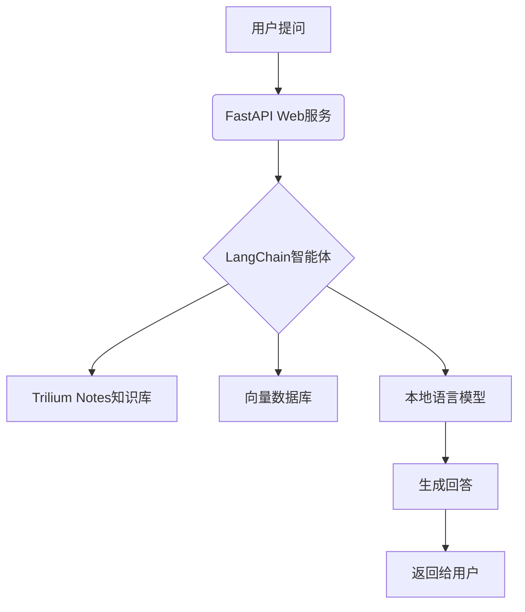

方案.md
# 集成本地知识库 Trilium Notes 的最佳方案

对于集成 Trilium Notes 本地知识库来提供更精准回答的智能体，我推荐使用以下技术栈：

## 🏆 核心框架选择：FastAPI + LangChain

### 为什么这个组合最合适？
```python
# 完美契合点：
- ⚡ FastAPI：超高性能异步框架，适合实时智能体响应
- 🤖 LangChain：专为知识库集成设计的AI框架，内置Trilium支持
- 🔍 强大的检索增强生成(RAG)能力：精准提取知识库内容
- 🧠 本地模型支持：可完全离线运行，保护隐私
```

## 🧩 完整技术栈方案

### 核心组件
| 组件 | 选择 | 作用 |
|------|------|------|
| **Web框架** | FastAPI | 构建高性能API端点 |
| **AI框架** | LangChain | 连接知识库和语言模型 |
| **知识库** | Trilium Notes | 本地知识存储 |
| **向量数据库** | Chroma(本地) | 存储知识库嵌入向量 |
| **嵌入模型** | sentence-transformers | 文本向量化 |
| **语言模型** | GPT4All/Llama.cpp | 本地运行的大模型 |
| **前端** | Streamlit/Gradio | 快速构建交互界面 |

## 🚀 系统架构设计



## 🔧 具体实现步骤

### 1. 配置 Trilium 数据访问
```python
from langchain.document_loaders import TriliumLoader

# 连接到本地 Trilium 实例
loader = TriliumLoader(
base_url="http://localhost:8080",
token="YOUR_API_TOKEN",# Trilium的API令牌
note_ids=["root"]# 从根笔记开始
)

# 加载知识库文档
documents = loader.load()
```

### 2. 创建向量知识库
```python
from langchain.embeddings import HuggingFaceEmbeddings
from langchain.vectorstores import Chroma
from langchain.text_splitter import RecursiveCharacterTextSplitter

# 分割文档
text_splitter = RecursiveCharacterTextSplitter(chunk_size=1000, chunk_overlap=200)
texts = text_splitter.split_documents(documents)

# 创建嵌入模型
embeddings = HuggingFaceEmbeddings(model_name="all-MiniLM-L6-v2")

# 创建本地向量数据库
vector_db = Chroma.from_documents(
documents=texts,
embedding=embeddings,
persist_directory="./chroma_db"
)
```

### 3. 构建智能问答链
```python
from langchain.chains import RetrievalQA
from langchain.llms import GPT4All

# 加载本地语言模型
llm = GPT4All(
model="./models/ggml-gpt4all-j-v1.3-groovy.bin",
n_ctx=2048,
backend='gptj',
verbose=False
)

# 创建检索式问答链
qa_chain = RetrievalQA.from_chain_type(
llm=llm,
chain_type="stuff",
retriever=vector_db.as_retriever(search_kwargs={"k": 3}),
return_source_documents=True
)
```

### 4. 创建 FastAPI 服务
```python
from fastapi import FastAPI
from pydantic import BaseModel

app = FastAPI()

class QuestionRequest(BaseModel):
question: str

@app.post("/ask")
async def ask_question(request: QuestionRequest):
# 使用知识库增强的问答链
result = qa_chain({"query": request.question})

return {
"answer": result["result"],
"sources": [doc.metadata["source"] for doc in result["source_documents"]]
}
```

### 5. 添加前端界面 (可选)
```python
# 使用 Streamlit 快速创建界面
import streamlit as st
from backend import qa_chain# 导入上面创建的问答链

st.title("Trilium知识库智能助手")
question = st.text_input("请输入您的问题:")

if question:
result = qa_chain({"query": question})
st.write("### 回答:")
st.write(result["result"])

st.write("### 来源笔记:")
for doc in result["source_documents"]:
st.write(f"- {doc.metadata['source']}")
```

## 🧠 高级功能增强

### 知识库自动更新监控
```python
import time
from watchdog.observers import Observer
from watchdog.events import FileSystemEventHandler

class TriliumChangeHandler(FileSystemEventHandler):
def on_modified(self, event):
if "notes" in event.src_path:
print("检测到知识库更新，重新加载...")
# 重新加载知识库和更新向量数据库

# 启动监控
observer = Observer()
observer.schedule(TriliumChangeHandler(), path="/path/to/trilium/data", recursive=True)
observer.start()
```

### 对话历史记忆
```python
from langchain.memory import ConversationBufferMemory

memory = ConversationBufferMemory(
memory_key="chat_history",
return_messages=True
)

# 创建带记忆的对话链
conversational_qa = ConversationalRetrievalChain.from_llm(
llm=llm,
retriever=vector_db.as_retriever(),
memory=memory
)
```

## ⚙️ 部署方案

### 本地部署
```bash
# 安装依赖
pip install fastapi uvicorn langchain chromadb sentence-transformers gpt4all

# 启动服务
uvicorn main:app --reload --port 8000
```

### Docker 部署
```dockerfile
FROM python:3.10-slim

WORKDIR /app
COPY . .

RUN pip install -r requirements.txt

# 下载模型
RUN wget https://gpt4all.io/models/ggml-gpt4all-j-v1.3-groovy.bin -P ./models

CMD ["uvicorn", "main:app", "--host", "0.0.0.0", "--port", "8000"]
```

## 📊 性能优化建议

1. **增量更新**：只处理Trilium中变更的笔记，避免全量重建索引
2. **模型量化**：使用4-bit量化的本地模型减小内存占用
3. **缓存机制**：对常见问题答案进行缓存
4. **分级检索**：先关键词检索缩小范围，再语义检索

**总结**：使用 **FastAPI + LangChain + 本地LLM(GPT4All/Llama)** 的组合，你可以构建一个完全本地的智能体系统，充分利用Trilium Notes中的知识提供精准回答，同时保护数据隐私。这个方案兼顾了性能、准确性和安全性，特别适合需要处理敏感数据的场景。